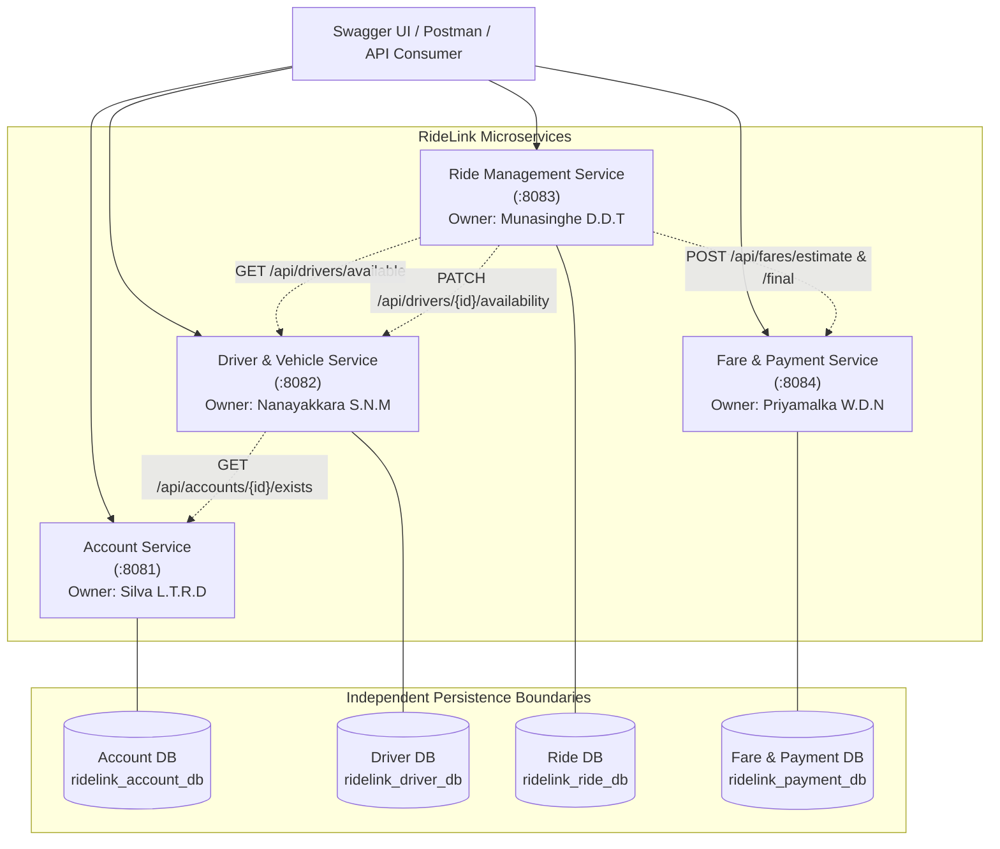

# RideLink – Backend Microservices for a Ride-Sharing Platform

**Course**: IT3130 – Application Development  
**Assessment**: Group Assignment (30%)  
**Academic Year / Semester**: Y3S1  
**Architecture Style**: Microservices Architecture with Domain-Driven Service Boundaries & Independent Persistence Boundaries

---

## Group Members & Responsibilities

| Student Name | Student ID | Assigned Microservice | Primary Ownership & Module Responsibilities |
|---|---|---|---|
| **Silva L.T.R.D** | **IT24102723** | **Account Service** | Passenger & driver registration, authentication, JWT tokens, role-based authorization, user profiles, account status management. |
| **Nanayakkara S.N.M** | **IT24102468** | **Driver & Vehicle Service** | Driver operational profiles, license tracking, vehicle registration, availability states, simulated GPS locations, eligible available driver retrieval. |
| **Munasinghe D.D.T** | **IT24102566** | **Ride Management Service** | Ride requests, pickup & destination coordinates, driver assignment, ride state machine lifecycle, trip execution, and history. |
| **Priyamalka W.D.N** | **IT24102758** | **Fare & Payment Service** | Configurable fare estimation, final trip fare calculation, payment simulation, payment transaction tracking, and receipt issuance. |

---

## 1. Project Overview

**RideLink** is a distributed ride-sharing backend system developed for the IT3130 Application Development group assignment. RideLink allows passengers to register, log in, request rides, obtain upfront fare estimates, track their trip lifecycle, and record simulated payments with downloadable receipts. Drivers can register vehicles, declare operational availability, update their simulated locations, and accept/execute ride assignments.

In accordance with official course requirements:
- Implemented strictly with **Java 17/21 and Spring Boot 3**.
- Comprises **four independently executable microservices**, each running on a distinct port and owning its own isolated persistence boundary.
- Employs **synchronous REST interservice communication** via Spring `RestClient`.
- Provides **interactive Swagger UI / OpenAPI documentation** and an exported **Postman collection with environment configuration**.
- Contains **automated JUnit 5 / Mockito unit tests** and a **GitHub Actions CI pipeline**.

---

## 2. Architecture & Data Ownership



### Database Ownership & Rules
- **Account Service**: `ridelink_account_db` (holds `users`)
- **Driver & Vehicle Service**: `ridelink_driver_db` (holds `driver_profiles`, `vehicles`)
- **Ride Management Service**: `ridelink_ride_db` (holds `rides`)
- **Fare & Payment Service**: `ridelink_payment_db` (holds `fare_records`, `payments`, `receipts`)
- **Zero Cross-Database Coupling**: Microservices never share database schemas, tables, or connections. Data exchange is achieved exclusively via documented HTTP REST APIs.

---

## 3. Technologies Used

- **Language**: Java 17 / Java 21 LTS
- **Core Framework**: Spring Boot 3.2.5
- **Web Layer**: Spring Web MVC
- **Security**: Spring Security 6 with BCrypt password hashing & JWT (`io.jsonwebtoken:jjwt:0.12.5`)
- **Persistence**: Spring Data JPA with isolated in-memory H2 databases (compatible with PostgreSQL/MySQL)
- **Validation**: Jakarta Bean Validation (`spring-boot-starter-validation`)
- **HTTP Client**: Modern Spring `RestClient` for synchronous interservice REST calls
- **API Documentation**: Springdoc OpenAPI 2.3.0 / Swagger UI
- **Testing**: JUnit 5, Mockito, Spring Boot Test
- **Build & CI**: Apache Maven 3.9+, GitHub Actions

---

## 4. Service Ports & Swagger Documentation

| Microservice | Port | Swagger UI Endpoint | OpenAPI Spec |
|---|---|---|---|
| **Account Service** | `8081` | [http://localhost:8081/swagger-ui/index.html](http://localhost:8081/swagger-ui/index.html) | `/v3/api-docs` |
| **Driver & Vehicle Service** | `8082` | [http://localhost:8082/swagger-ui/index.html](http://localhost:8082/swagger-ui/index.html) | `/v3/api-docs` |
| **Ride Management Service** | `8083` | [http://localhost:8083/swagger-ui/index.html](http://localhost:8083/swagger-ui/index.html) | `/v3/api-docs` |
| **Fare & Payment Service** | `8084` | [http://localhost:8084/swagger-ui/index.html](http://localhost:8084/swagger-ui/index.html) | `/v3/api-docs` |

---

## 5. Environment Variables & Configuration

The microservices operate out of the box with default zero-configuration local profiles. In production or containerized environments, the following environment variables can be customized:

| Environment Variable | Service | Default Value | Description |
|---|---|---|---|
| `JWT_SECRET` | Account Service | Base64-encoded 256-bit key | Secret key used for signing and verifying JWT tokens |
| `ACCOUNT_SERVICE_URL` | Driver Service | `http://localhost:8081` | Base URL for Account Service interservice communication |
| `DRIVER_SERVICE_URL` | Ride Service | `http://localhost:8082` | Base URL for Driver Service interservice communication |
| `FARE_SERVICE_URL` | Ride Service | `http://localhost:8084` | Base URL for Fare Service interservice communication |

---

## 6. Installation & Execution Instructions

### Prerequisites
- Java Development Kit (JDK 17 or 21)
- Apache Maven 3.8+ (or use installed Maven wrapper)

### Build and Test the Complete Solution
Run from the root directory:
```bash
mvn clean test
```

### Running the Services

Open four separate terminal windows and run each service independently:

#### 1. Run Account Service (Port 8081)
```bash
cd account-service
mvn spring-boot:run
```

#### 2. Run Driver & Vehicle Service (Port 8082)
```bash
cd driver-vehicle-service
mvn spring-boot:run
```

#### 3. Run Ride Management Service (Port 8083)
```bash
cd ride-management-service
mvn spring-boot:run
```

#### 4. Run Fare & Payment Service (Port 8084)
```bash
cd fare-payment-service
mvn spring-boot:run
```

---

## 7. Complete 18-Step Workflow Demonstration

The integrated system implements the complete ride-sharing lifecycle across the 4 microservices:

1. **Step 1**: Passenger registers via `POST /api/auth/register/passenger` (Account Service :8081)
2. **Step 2**: Driver registers via `POST /api/auth/register/driver` (Account Service :8081)
3. **Step 3**: Passenger logs in via `POST /api/auth/login` and receives signed JWT
4. **Step 4**: Driver logs in via `POST /api/auth/login` and receives signed JWT
5. **Step 5**: Driver creates operational profile via `POST /api/drivers` (Driver Service :8082 calls Account Service to verify `ROLE_DRIVER`)
6. **Step 6**: Driver registers vehicle via `POST /api/vehicles` (Driver Service :8082)
7. **Step 7**: Driver sets availability to `AVAILABLE` via `PATCH /api/drivers/{id}/availability`
8. **Step 8**: Driver updates simulated location coordinates via `PATCH /api/drivers/{id}/location`
9. **Step 9**: Passenger requests fare estimate via `POST /api/fares/estimate` (Fare Service :8084)
10. **Step 10**: Passenger creates ride via `POST /api/rides` (Ride Service :8083, status: `REQUESTED`)
11. **Step 11**: System triggers driver discovery via `POST /api/rides/{id}/assign` (Ride Service calls Driver Service `GET /api/drivers/available`)
12. **Step 12**: Eligible driver is assigned (Ride status: `ASSIGNED`, driver availability set to `BUSY`)
13. **Step 13**: Driver accepts ride via `POST /api/rides/{id}/accept` (status: `ACCEPTED`)
14. **Step 14**: Driver starts ride via `POST /api/rides/{id}/start` (status: `IN_PROGRESS`)
15. **Step 15**: Driver completes ride via `POST /api/rides/{id}/complete` (status: `COMPLETED`)
16. **Step 16**: Final fare is calculated by Fare Service based on actual distance and duration (`POST /api/fares/final`)
17. **Step 17**: Passenger records simulated payment via `POST /api/payments` (Fare Service :8084, status: `SUCCESS`)
18. **Step 18**: Passenger retrieves official payment receipt via `GET /api/receipts/ride/{rideId}`

---

## 8. Negative Test Scenarios Handled

1. **Negative Scenario 1 – No Available Drivers**:
   - Calling `POST /api/rides/{id}/assign` when no drivers are online/available returns HTTP `404 Not Found` with message: `"No available drivers found in the system for assignment"`.
2. **Negative Scenario 2 – Invalid Ride Status Lifecycle Transition**:
   - Attempting to transition `REQUESTED -> IN_PROGRESS` or `COMPLETED -> IN_PROGRESS` returns HTTP `400 Bad Request` with message: `"Cannot start ride in state: REQUESTED. Ride must be in ACCEPTED state."`.
3. **Negative Scenario 3 – Duplicate Registration Violations**:
   - Registering an existing email or vehicle license plate returns HTTP `409 Conflict`.
4. **Negative Scenario 4 – Simulated Payment Failure**:
   - Submitting `simulateFailure: true` in `POST /api/payments` produces a `FAILED` payment record with `simulatedFailureReason: "Simulated card payment authorization declined by issuer"`.
5. **Negative Scenario 5 – Unauthorized Access & Bad Credentials**:
   - Invalid login credentials return HTTP `401 Unauthorized`. Tampered or missing JWT tokens return HTTP `401`.

---

## 9. Postman Collection & Environment

A shared, complete Postman testing suite is available in the [`postman/`](./postman/) directory:
- [`postman/RideLink.postman_collection.json`](./postman/RideLink.postman_collection.json): Contains 11 organized folders covering all endpoints, happy-path flows, and negative scenario test scripts.
- [`postman/RideLink-Local.postman_environment.json`](./postman/RideLink-Local.postman_environment.json): Pre-configured environment variables for service URLs and dynamic ID chaining.

### How to Run in Postman:
1. Open Postman -> Click **Import** -> Select both files in the `postman/` directory.
2. Select the **RideLink-Local** environment from the top-right dropdown.
3. Open the collection and run requests in numerical sequence from `01 Authentication` to `11 Negative Tests`, or click **Run collection** to run the automated test assertions!

---

## 10. Automated Testing Evidence

Every service contains independent unit tests built with JUnit 5 and Mockito:

- **Account Service**: `AccountServiceTest` (9 tests covering passenger/driver registration, duplicate rejection, login, JWT issuance, profile updates, status, and exists check).
- **Driver & Vehicle Service**: `DriverServiceTest` (7 tests) & `VehicleServiceTest` (6 tests covering driver onboarding, account verification, availability, location, and vehicle management).
- **Ride Management Service**: `RideServiceTest` (9 tests covering ride creation, driver discovery, status lifecycle state machine transitions, and negative edge cases).
- **Fare & Payment Service**: `FareServiceTest` (2 tests) & `PaymentServiceTest` (3 tests verifying mathematical fare calculation accuracy, payment simulation, and receipt generation).

**Total Tests**: **36 Unit Tests** (100% Pass Rate).

---

## 11. Git Branching Strategy & Workflow

The team followed a feature-branch collaborative workflow:
- `main`: Production-ready, fully integrated microservices code.
- `develop` / `integration`: Integration branch for cross-service testing.
- Feature branches assigned per member:
  - `feature/T24102723-account-service` (Silva L.T.R.D)
  - `feature/T24102468-Driver-&-Vehicle-Service` (Nanayakkara S.N.M)
  - `feature/IT24102566-Ride-Management-Service` (Munasinghe D.D.T)
  - `feature/IT24102758-Fare-&-Payment-Service` (Priyamalka W.D.N)

---

## 12. Microservices vs. Monolithic Architecture Comparison

*(Documented for IT3130 Report LO1/LO2 Evidence)*

| Architecture Dimension | RideLink Microservices Architecture | Modular Monolithic Alternative |
|---|---|---|
| **Service Granularity** | Decomposed into 4 independently executable services | Single executable application enclosing 4 logical modules |
| **Data Ownership** | 4 separate physical/in-memory databases with zero cross-database queries | Single shared database with shared tables and foreign key joins |
| **Team Autonomy** | High: Each student develops, configures, and tests their own service | Low/Medium: Code conflicts and shared database schema migration bottlenecks |
| **Deployment & Scaling**| Independent: Ride Service can scale up during peak traffic without scaling Account Service | Must scale and redeploy entire monolith application together |
| **Fault Isolation** | High: A crash in simulated payment does not bring down user authentication or ride requests | Low: A memory leak or fatal runtime exception crashes the whole JVM |
| **Communication** | Network REST API calls with fault-tolerant fallbacks | In-process JVM method calls |
| **Operational Overhead**| Higher initial configuration (multiple ports, networking, contract tests) | Simpler local execution (single `java -jar`) |

### Academic Justification:
For the RideLink project, the **microservices architecture** was selected because it aligns directly with the four-student group structure, provides verifiable individual contribution evidence, enforces strict data encapsulation, and fulfills the course learning outcomes on inter-application communication and independent persistence boundaries.