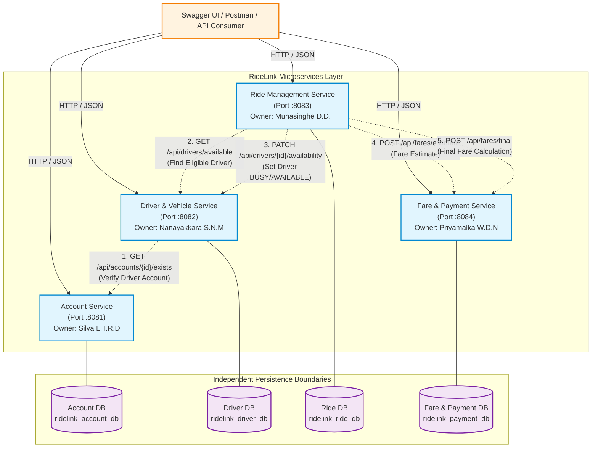

# RideLink System Architecture Documentation

**Document Code**: IT3130-ARCH-01  
**Project**: RideLink – Backend Microservices for a Ride-Sharing Platform  
**Architecture Style**: Microservices Architecture with Domain-Driven Service Boundaries & Independent Persistence Boundaries

---

## 1. System Overview

RideLink is a distributed backend platform designed for a modern ride-hailing service. To satisfy the IT3130 Application Development assignment requirements, the system is decomposed into **four independently executable Spring Boot microservices**, each deployed with its own persistent data store, configuration, business domain logic, and OpenAPI/Swagger documentation.

---

## 2. High-Level Architecture Diagram

---

## 3. Microservice Boundaries and Data Ownership

| Service Name | Port | Primary Owner | Student ID | Database Name | Owned Data Entities |
|---|---|---|---|---|---|
| **Account Service** | 8081 | Silva L.T.R.D | IT24102723 | `ridelink_account_db` | `User` (Passengers, Drivers, Admins) |
| **Driver & Vehicle Service** | 8082 | Nanayakkara S.N.M | IT24102468 | `ridelink_driver_db` | `DriverProfile`, `Vehicle` |
| **Ride Management Service** | 8083 | Munasinghe D.D.T | IT24102566 | `ridelink_ride_db` | `Ride` (State Machine & History) |
| **Fare & Payment Service** | 8084 | Priyamalka W.D.N | IT24102758 | `ridelink_payment_db` | `FareRecord`, `Payment`, `Receipt` |

### Database Independence Rules
1. **Strict Persistence Boundary**: Under no circumstances does any microservice connect to, query, or execute cross-service SQL joins against another service's database.
2. **Data Sharing via REST Contracts**: When Driver Service needs to verify account roles, it invokes Account Service's REST API. When Ride Service needs fare calculation or driver availability, it communicates strictly through HTTP/REST.

---

## 4. Interservice Communication Design

RideLink utilizes **synchronous RESTful communication** using Spring Boot 3's modern `RestClient`:

1. **Driver Service -> Account Service**:
   - `GET /api/accounts/{id}/exists`
   - Purpose: Verifies whether the account exists and holds the role `DRIVER` before creating an operational driver profile.
2. **Ride Management Service -> Driver & Vehicle Service**:
   - `GET /api/drivers/available`
   - Purpose: Discovers online drivers who are currently `AVAILABLE` to accept a ride.
   - `PATCH /api/drivers/{id}/availability`
   - Purpose: Marks driver as `BUSY` when assigned/in-progress and returns them to `AVAILABLE` on ride completion or cancellation.
3. **Ride Management Service -> Fare & Payment Service**:
   - `POST /api/fares/estimate`
   - Purpose: Obtains upfront fare estimate during ride creation.
   - `POST /api/fares/final`
   - Purpose: Calculates authoritative final fare based on actual trip distance and elapsed time.

---

## 5. Architectural Comparison: Microservices vs. Monolith

*(Provided for Technical Report Comparison)*

| Comparison Criteria | RideLink Microservices Architecture | Modular Monolithic Alternative |
|---|---|---|
| **Deployment Unit** | 4 independent JAR executables, deployable and scalable separately | Single monolithic JAR containing all packages |
| **Database Boundary** | 4 distinct databases (`ridelink_*_db`) with zero cross-database coupling | Single shared database with cross-table foreign keys and joins |
| **Team Autonomy** | High: Each student owns their service, code, models, and tests | Medium: All students work in one unified codebase, higher merge risk |
| **Failure Isolation** | High: Failure in Fare Service does not crash Account or Ride Service | Low: Unhandled memory leak or crash impacts entire system |
| **Communication** | Network REST API calls with fault-tolerant fallbacks | In-memory Java method invocations |
| **Testing** | Independent unit and mock testing per microservice boundary | Comprehensive monolithic integration and end-to-end tests |
| **Development Complexity**| Higher upfront overhead (ports, networking, DTO contracts) | Simpler initial local development and debugging |
| **Suitability for IT3130**| **Optimal**: Exactly matches 4 student owners and learning outcomes | Suitable as a conceptual baseline comparison only |
