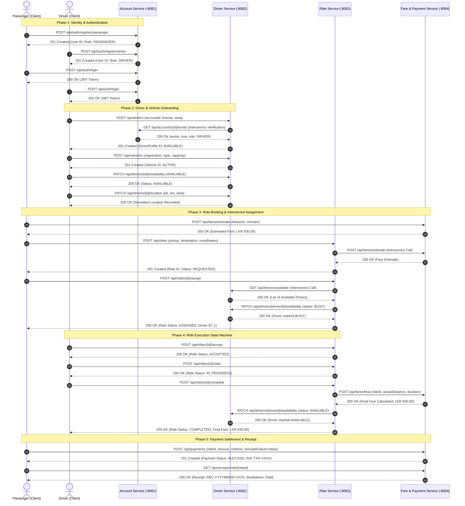
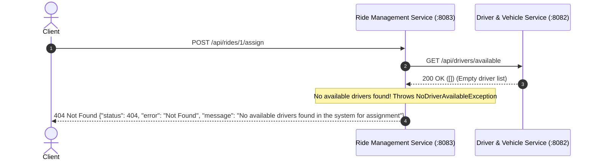
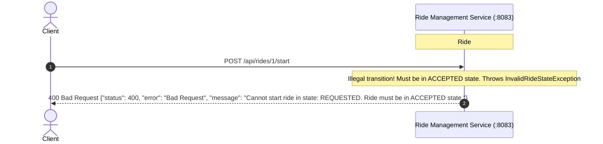
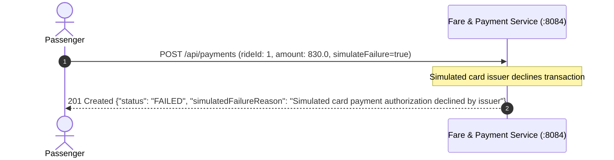

# RideLink End-to-End Workflow & Sequence Diagrams

**Document Code**: IT3130-SEQ-01  
**Project**: RideLink – Backend Microservices for a Ride-Sharing Platform  

---

## 1. Happy-Path End-to-End Sequence Diagram (18 Steps)

This sequence diagram illustrates the complete end-to-end lifecycle across the 4 microservices:

---

## 2. Negative Scenario 1: Driver Unavailable During Assignment

---

## 3. Negative Scenario 2: Invalid Ride Status Lifecycle Transition

---

## 4. Negative Scenario 3: Simulated Payment Processing Failure

